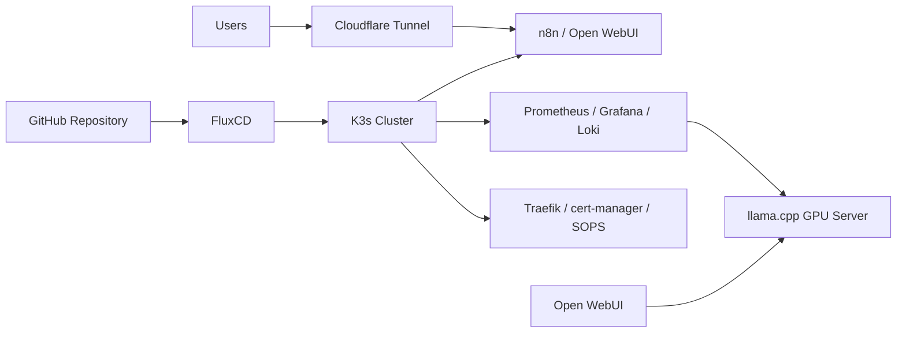

# homelab

## What this demonstrates

This repository documents a production-like engineering and
validation environment I use to evaluate AI infrastructure and validate
recommendations before introducing them into client environments.

It demonstrates:

- GitOps-based Kubernetes operations
- secure secrets and ingress management
- local and private-network LLM inference
- metrics and log observability
- tested backup and recovery procedures
- deliberate upgrade and dependency-management practices

The environment currently supports n8n automation, Open WebUI, local
llama.cpp inference, and the monitoring foundation for AI agents and
retrieval-grounded knowledge systems.

## Current workloads

Two apps and one monitoring pattern make up the AI-facing surface of this
cluster today, with more planned:

- **n8n** — the workflow/automation layer, exposed through the tunnel, with
  its own Prometheus metrics enabled and execution history pruned on a
  rolling window so state doesn't grow unbounded.
- **open-webui** — the chat interface. It deliberately runs no inference
  itself; it's configured to call out to a LAN-hosted llama.cpp instance. That
  split keeps GPU-bound inference compute off the Kubernetes node entirely
  and treats "chat UI" and "model serving" as separate concerns with
  separate scaling and hardware requirements.
- **Bridging non-Kubernetes inference servers into Prometheus.** LAN-hosted
  llama.cpp inference servers (running outside the cluster, on bare metal)
  are scraped using the same `ServiceMonitor`
  contract as every in-cluster workload — a headless `Service` paired with a
  hand-authored `Endpoints` object stands in for kube-proxy's usual
  service-discovery, so a process that was never scheduled by Kubernetes
  still shows up in the same Grafana dashboards as everything that was. One
  monitoring integration point regardless of where the workload actually
  runs.

**Roadmap:** the next phase of this stack is a self-hosted AI platform
layer — vector storage, local search, workflow orchestration, and LLM
observability/tracing — designed to sit alongside n8n and open-webui rather
than replace them. This is in-progress design work, not yet running in the
cluster, and is called out here as direction rather than a shipped feature.

## Architecture diagram



## Engineering decisions

A GitOps-managed Kubernetes cluster, reconciled continuously by **FluxCD**
from this repository. Everything — workloads, ingress, TLS, secrets,
monitoring, and the dependency ordering between them — is declarative YAML
under version control. There's a single environment, `staging`, run with the
same discipline you'd expect from a production-like system: encrypted
secrets, tested backup/restore, and a controlled upgrade path rather than ad
hoc `kubectl apply`.

For the full inventory of running applications and day-to-day operational
commands, see [`CLAUDE.md`](CLAUDE.md). For deep-dive runbooks, see
[`docs/operations/`](docs/operations/).

### Dependency and TLS design

Flux reconciles applications, infrastructure, and monitoring through explicit
dependency ordering. TLS resources are structured differently across those
trees to avoid circular bootstrap dependencies.

See [Dependency and TLS Design](docs/architecture/dependency-tls.md).

### Uniform structure

Every application and every infrastructure controller follows the same
`base/` + `staging/` overlay split (Kustomize): base owns the
namespace/deployment/service/storage, the overlay adds ingress and
environment-specific patches. New apps are additive — a new directory plus
one line in a parent `kustomization.yaml` — rather than a special case to
design around.

### Secrets management

Every secret is encrypted in place as a `*.enc.yaml` file (SOPS + AGE) and
decrypted at reconcile time by Flux using an AGE key held only as a cluster
secret. Encryption is restricted to `data`/`stringData` fields, so a
`git diff` on a secret still shows a legible, reviewable change instead of an
opaque blob — a deliberate tradeoff of operational simplicity over a
KMS-backed manager's centralized rotation/audit, appropriate for a
single-operator cluster.

### Exposure model

Internet-facing hosts go through a Cloudflare Tunnel (outbound-only, no
inbound port ever opened); LAN-only hosts get a Traefik `Ingress` with a
publicly-trusted TLS cert via Let's Encrypt/Cloudflare DNS-01, so "internal"
never means a self-signed cert. The one intentional exception to
"everything is GitOps" is the tunnel's own routing table, which is managed
in the Cloudflare dashboard rather than git so route changes hot-reload with
zero downtime — a documented tradeoff, not drift.

### Vendored dependencies

One app's only published Helm chart was broken upstream, with the community
fix stuck as an unmerged pull request. Rather than depend on a fork branch
staying alive, the fixed chart was vendored in-tree and pinned — the one app
in the cluster sourced that way.

See [Postiz Deployment & Operations](docs/operations/postiz.md) for the full
story.

## Operations & reliability

### Observability

- **kube-prometheus-stack** (Prometheus + Alertmanager + Grafana) is the
  metrics backbone. Prometheus's TSDB is backed by a PVC rather than the
  chart's default `emptyDir`, with retention and retention-size tuned
  together so Prometheus trims old data on its own before the volume fills
  — a metrics history that survives pod reschedules without an unbounded
  disk-fill risk. Grafana sits behind Traefik with its own trusted TLS cert
  and admin credentials sourced from a SOPS-encrypted secret, never a chart
  default.
- **Loki** handles logs, wired into the same Grafana as a datasource rather
  than standing up a second Grafana instance — one pane of glass for metrics
  and logs, not two dashboards to keep in sync.
- **ServiceMonitors as the uniform integration contract.** Every workload
  that needs to be observed — in-cluster app, datastore exporter, or a
  bare-metal inference server outside Kubernetes entirely — is onboarded the
  same way: a `ServiceMonitor` pointed at a `Service`. New apps get
  dashboards and alerting by following one well-understood pattern instead
  of a bespoke integration per data source.
- **Self-hosted by choice, not by default.** A managed observability SaaS
  would be less operational overhead, but self-hosting keeps all metrics and
  log data on infrastructure that's actually owned, and it means working
  directly with the Prometheus Operator's CRDs (`ServiceMonitor`,
  `PrometheusRule`) rather than a vendor's abstraction over them.

### Backup & restore

GitOps already backs up *configuration* — every Deployment, ConfigMap, and
HelmRelease is reconstructable from `git clone` alone. Only stateful data on
persistent volumes needs an explicit strategy, and that runs in escalating
tiers: ad hoc single-app snapshots, a scripted routine that covers every
stateful app plus Flux's own state, and Velero identified as the next step
once that overhead is justified at this cluster's scale. Recovery targets
(RTO/RPO) are defined per failure scenario, and large or easily-re-sourced
data (media libraries, caches) is deliberately excluded from the routine
path.

See [Backup & Restore](docs/operations/backup-restore.md) for the full
procedures and current recovery targets.

### Upgrades & dependency management

#### Dependency updates

Renovate opens PRs for image tags, Helm chart versions, and Flux manifests,
but nothing auto-merges — every change gets human review before it reaches
the cluster. Guardrails are encoded as policy rather than habit: a stateful
datastore's major-version bumps are disabled by an explicit Renovate rule,
since a tag change can't perform the in-place data migration a major version
actually needs.

See [Dependency & Upgrade Policy](docs/architecture/dependency-management.md).

#### Cluster upgrades

Cluster upgrades step through intermediate minor versions rather than
jumping straight to the target release, and are preceded by a datastore
backup — in this cluster's case the k3s SQLite datastore (single control
plane, no etcd), backed up as a directory copy rather than an etcd snapshot.

#### Horizontal growth

Every PVC in this cluster uses `local-path` storage, which binds data to
whichever node created it, so adding a second node is a data-placement
problem and not just added capacity.

See [Storage & Horizontal Scaling](docs/architecture/storage-and-scaling.md).

### Node maintenance

Container image layers accumulate on the node with every update and are
only garbage-collected under real disk pressure. A scheduled job prunes
unused images on a regular cadence instead, covered in the backup runbook's
[node maintenance section](docs/operations/backup-restore.md#monthly-node-maintenance-container-image-prune).

## Tech stack

| Layer | Tool |
|---|---|
| Cluster | K3s |
| GitOps / reconciliation | FluxCD |
| Manifest management | Kustomize (base/overlay) |
| Package management | Helm |
| Secrets | SOPS + AGE |
| Ingress | Traefik |
| TLS | cert-manager (Let's Encrypt via Cloudflare DNS-01) |
| Internet exposure | Cloudflare Tunnel |
| Metrics | kube-prometheus-stack (Prometheus, Alertmanager, Grafana) |
| Logs | Loki |
| Dependency updates | Renovate |

## Repo layout

```
clusters/staging/       Flux Kustomization entrypoints (what Flux watches)
apps/
  base/                  Base manifests per application
  staging/               Staging overlays (ingress, env-specific patches)
infrastructure/
  controllers/
    base/                Base infra controller manifests and HelmReleases
    staging/              Staging overlays
monitoring/
  controllers/            kube-prometheus-stack + Loki HelmReleases
  configs/                Cluster-specific monitoring config
scripts/                 Backup/restore automation
docs/architecture/       Design-decision deep dives (TLS, dependency policy, storage/scaling)
docs/operations/         Runbooks: backup/restore, per-app deep dives
```

## Deep dives

**Architecture:**
- [Dependency and TLS Design](docs/architecture/dependency-tls.md) — Flux
  reconciliation ordering and why TLS is issued two different ways.
- [Dependency & Upgrade Policy](docs/architecture/dependency-management.md)
  — the full Renovate automation and guardrail policy.
- [Storage & Horizontal Scaling](docs/architecture/storage-and-scaling.md) —
  the `local-path` storage tradeoff and the second-node migration plan.

**Operations:**
- [`CLAUDE.md`](CLAUDE.md) — full application inventory, operational
  commands, and conventions.
- [`docs/operations/backup-restore.md`](docs/operations/backup-restore.md) —
  full backup/restore procedures, recovery targets, and node image-pruning.
- [`docs/operations/postiz.md`](docs/operations/postiz.md) — a full
  deployment writeup, including the vendored-chart story referenced above.
- [`docs/operations/grafana-sops-credentials.md`](docs/operations/grafana-sops-credentials.md)
  — Grafana credential management via SOPS.
