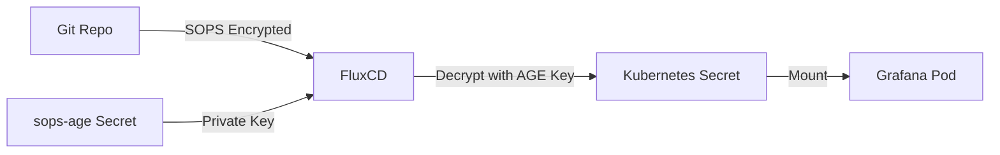

# Grafana SOPS Credentials Management

## 📋 Overview

Grafana admin credentials are managed securely using SOPS (Secrets OPerationS) encryption with AGE keys. The credentials are stored encrypted in Git and automatically decrypted by FluxCD during deployment.

> [!info] Key Benefits
> - ✅ Secrets encrypted in Git repository
> - ✅ Automatic decryption by FluxCD
> - ✅ Disaster recovery ready
> - ✅ No plain text passwords
> - ✅ Full audit trail via Git history

## 🏗️ Architecture

### Components


| Component | Purpose |
|-----------|---------|
| **SOPS** | Encrypts/decrypts secrets using AGE encryption |
| **FluxCD Kustomize Controller** | Automatically decrypts SOPS-encrypted files during reconciliation |
| **AGE Key** | Stored in cluster as `sops-age` secret in `flux-system` namespace |
| **Grafana Helm Chart** | Configured to use Kubernetes secret for admin credentials |

### 📁 File Structure
```
monitoring/
├── controllers/
│   ├── base/
│   │   └── kube-prometheus-stack/
│   │       ├── grafana-credentials.enc.yaml  # SOPS-encrypted secret
│   │       ├── kustomization.yaml            # References encrypted secret
│   │       ├── release.yaml                  # HelmRelease with secret reference
│   │       ├── repository.yaml
│   │       └── namespace.yaml
│   └── staging/
│       └── kube-prometheus-stack/
│           └── kustomization.yaml

clusters/staging/
└── monitoring.yaml                           # Kustomization with SOPS decryption enabled

docs/operations/
├── grafana-sops-credentials.md               # This file (comprehensive)
└── grafana-sops-quick-reference.md           # Quick reference card

.sops.yaml                                    # SOPS configuration (repo root)
```

## 🔐 Secret Structure

### Encrypted Secret File

**Location**: `monitoring/controllers/base/kube-prometheus-stack/grafana-credentials.enc.yaml`

The encrypted secret contains two keys:
- `admin-user`: Grafana admin username (default: `admin`)
- `admin-password`: Grafana admin password
```yaml
apiVersion: v1
kind: Secret
metadata:
  name: grafana-admin-credentials
  namespace: monitoring
type: Opaque
stringData:
  admin-user: ENC[AES256_GCM,...]
  admin-password: ENC[AES256_GCM,...]
sops:
  age:
    - recipient: age1vmka94kas8cez0jm80zyhyx9uahm4ldc5d2tm4yjltmqw2xckfaspauh3c
      enc: |
        -----BEGIN AGE ENCRYPTED FILE-----
        ...
        -----END AGE ENCRYPTED FILE-----
  encrypted_regex: ^(data|stringData)$
```

### HelmRelease Configuration

**Location**: `monitoring/controllers/base/kube-prometheus-stack/release.yaml`
```yaml
spec:
  values:
    grafana:
      admin:
        existingSecret: grafana-admin-credentials
        userKey: admin-user
        passwordKey: admin-password
```

> [!warning] Important
> The HelmRelease no longer contains plain text passwords. It references the Kubernetes secret created from the SOPS-encrypted file.

### Kustomization Reference

**Location**: `monitoring/controllers/base/kube-prometheus-stack/kustomization.yaml`
```yaml
apiVersion: kustomize.config.k8s.io/v1beta1
kind: Kustomization
resources:
  - namespace.yaml
  - repository.yaml
  - release.yaml
  - grafana-credentials.enc.yaml  # Include the encrypted secret
```

## ⚙️ FluxCD Decryption Configuration

**Location**: `clusters/staging/monitoring.yaml`
```yaml
apiVersion: kustomize.toolkit.fluxcd.io/v1
kind: Kustomization
metadata:
  name: monitoring-controllers
  namespace: flux-system
spec:
  interval: 1m0s
  retryInterval: 1m
  timeout: 5m
  sourceRef:
    kind: GitRepository
    name: flux-system
  path: ./monitoring/controllers/staging
  prune: true
  decryption:              # ⚠️ CRITICAL: Must be present
    provider: sops
    secretRef:
      name: sops-age       # AGE private key for decryption
```

> [!danger] Critical Configuration
> The `decryption` section **MUST** be present for SOPS to work. Without it, encrypted values will be applied to the cluster as-is and Grafana will fail to start.

## 🔧 SOPS Configuration

**Location**: `.sops.yaml` (repository root)
```yaml
creation_rules:
  - path_regex: .*.yaml
    encrypted_regex: ^(data|stringData)$
    age: age1vmka94kas8cez0jm80zyhyx9uahm4ldc5d2tm4yjltmqw2xckfaspauh3c
```

This configuration:
- ✅ Encrypts all `.yaml` files
- ✅ Only encrypts `data` and `stringData` fields (leaves metadata readable)
- ✅ Uses the specified AGE public key

## 🛠️ Operations

### 👀 Viewing Current Credentials
```bash
# Get username
kubectl get secret grafana-admin-credentials -n monitoring \
  -o jsonpath='{.data.admin-user}' | base64 -d

# Get password
kubectl get secret grafana-admin-credentials -n monitoring \
  -o jsonpath='{.data.admin-password}' | base64 -d
```

### ✏️ Updating Credentials

#### Method 1: Edit via SOPS directly
```bash
# Decrypt and edit in one command (opens in $EDITOR)
sops monitoring/controllers/base/kube-prometheus-stack/grafana-credentials.enc.yaml

# Edit the values:
# - Change admin-user or admin-password
# - SOPS will re-encrypt automatically when you save and exit

# Commit and push
git add monitoring/controllers/base/kube-prometheus-stack/grafana-credentials.enc.yaml
git commit -m "Update Grafana admin credentials"
git push

# Flux will automatically apply the changes
flux reconcile kustomization monitoring-controllers --with-source
```

#### Method 2: Create new encrypted secret from scratch
```bash
# Create unencrypted file
cat > /tmp/grafana-credentials.yaml <<YAML
apiVersion: v1
kind: Secret
metadata:
  name: grafana-admin-credentials
  namespace: monitoring
type: Opaque
stringData:
  admin-user: admin
  admin-password: your-new-password
YAML

# Encrypt it
sops --encrypt /tmp/grafana-credentials.yaml > \
  monitoring/controllers/base/kube-prometheus-stack/grafana-credentials.enc.yaml

# Clean up
rm /tmp/grafana-credentials.yaml

# Commit and push
git add monitoring/controllers/base/kube-prometheus-stack/grafana-credentials.enc.yaml
git commit -m "Update Grafana admin password"
git push
```

### 🚨 Emergency Password Reset

If you've lost the password and need to reset it:
```bash
# Option 1: Delete the secret and let Helm auto-generate
kubectl delete secret grafana-admin-credentials -n monitoring
kubectl delete secret kube-prometheus-stack-grafana -n monitoring
flux reconcile helmrelease kube-prometheus-stack -n monitoring

# Retrieve auto-generated password
kubectl get secret kube-prometheus-stack-grafana -n monitoring \
  -o jsonpath="{.data.admin-password}" | base64 -d

# Option 2: Manually create and encrypt new credentials (see "Updating Credentials")
```

## ✅ Verification

### Check Secret Decryption
```bash
# Verify secret exists and has correct keys
kubectl get secret grafana-admin-credentials -n monitoring

# Should show: admin-user, admin-password (2 data keys)
kubectl describe secret grafana-admin-credentials -n monitoring

# Verify values are decrypted (not SOPS encrypted text)
kubectl get secret grafana-admin-credentials -n monitoring \
  -o jsonpath='{.data.admin-user}' | base64 -d
# ✅ Should output: admin (not ENC[...])
```

### Check FluxCD Status
```bash
# Verify kustomization has decryption enabled
flux get kustomizations -n flux-system

# Check for reconciliation errors
flux logs --kind=Kustomization --name=monitoring-controllers

# Check HelmRelease status
kubectl get helmrelease kube-prometheus-stack -n monitoring
```

### Check Grafana Pod
```bash
# Verify Grafana is running
kubectl get pods -n monitoring -l app.kubernetes.io/name=grafana

# Check for secret mount issues
kubectl describe pod -n monitoring -l app.kubernetes.io/name=grafana | grep -A 5 "Mounts:"

# Check logs for authentication issues
kubectl logs -n monitoring -l app.kubernetes.io/name=grafana -c grafana
```

## 🐛 Troubleshooting

### Issue: Secret contains encrypted SOPS text instead of decrypted values

> [!bug] Symptoms
> ```bash
> kubectl get secret grafana-admin-credentials -n monitoring \
>   -o jsonpath='{.data.admin-password}' | base64 -d
> # Output: ENC[AES256_GCM,data:luAYsU5IGJ3D,...]
> ```

**Cause**: FluxCD kustomization doesn't have SOPS decryption enabled

**Solution**: 
```bash
# Check clusters/staging/monitoring.yaml has decryption section
cat clusters/staging/monitoring.yaml | grep -A 4 "decryption:"

# Should show:
#   decryption:
#     provider: sops
#     secretRef:
#       name: sops-age

# If missing, add it to clusters/staging/monitoring.yaml and push
```

---

### Issue: Grafana pod in CreateContainerConfigError

> [!bug] Symptoms
> ```bash
> kubectl get pods -n monitoring -l app.kubernetes.io/name=grafana
> # STATUS: CreateContainerConfigError
> ```

**Cause**: Secret missing required keys (admin-user or admin-password)

**Solution**:
```bash
# Check secret has both keys
kubectl get secret grafana-admin-credentials -n monitoring \
  -o jsonpath='{.data}' | jq

# Should show both admin-user and admin-password
# If missing admin-user, recreate the secret with both keys
```

---

### Issue: Cannot decrypt SOPS file locally

> [!bug] Symptoms
> ```bash
> sops --decrypt grafana-credentials.enc.yaml
> # Error: no master key was able to decrypt the file
> ```

**Cause**: AGE private key not available locally

**Solution**:
```bash
# Export AGE key from cluster
kubectl get secret sops-age -n flux-system \
  -o jsonpath='{.data.age\.agekey}' | base64 -d > ~/.config/sops/age/keys.txt

chmod 600 ~/.config/sops/age/keys.txt

# Now SOPS commands will work
sops --decrypt grafana-credentials.enc.yaml
```

---

### Issue: Wrong namespace in secret

> [!bug] Symptoms
> ```
> Secret/grafana-admin-credentials namespace not specified: 
> the server could not find the requested resource
> ```

**Cause**: Typo in `metadata.namespace` field

**Solution**:
```bash
# Edit the encrypted file
sops monitoring/controllers/base/kube-prometheus-stack/grafana-credentials.enc.yaml

# Ensure namespace is exactly: monitoring
metadata:
  name: grafana-admin-credentials
  namespace: monitoring  # Must match exactly (common typo: "monitorin")
```

---

### Issue: FluxCD reconciliation failed

> [!bug] Symptoms
> ```bash
> flux get kustomizations
> # monitoring-controllers: False - Health check failed
> ```

**Cause**: Various issues with kustomization or secret

**Solution**:
```bash
# Get detailed error
kubectl get kustomization monitoring-controllers -n flux-system -o yaml | tail -30

# Common fixes:
# 1. Check decryption is enabled (see first issue)
# 2. Check secret namespace matches (see third issue)
# 3. Force reconciliation
flux reconcile kustomization monitoring-controllers --with-source
```

## 🔒 Security Considerations

### 1. AGE Private Key Protection

> [!warning] Critical Secret
> The `sops-age` secret in `flux-system` namespace contains the private key that can decrypt all SOPS-encrypted secrets. Protect cluster access carefully.

**Best Practices**:
- Limit who has cluster admin access
- Use RBAC to restrict secret access
- Enable audit logging for secret access
- Rotate AGE keys periodically

### 2. Git History

Even though passwords are encrypted, consider them potentially compromised if:
- ❌ The AGE private key is ever exposed
- ❌ You need to rotate due to personnel changes
- ❌ Suspicious activity detected

**Recommendation**: Rotate passwords when in doubt.

### 3. Password Rotation Policy

Change passwords when:
- 🔄 Team members with access leave
- 🔄 Potential key compromise detected
- 🔄 Regular security policy intervals (e.g., every 90 days)
- 🔄 After any security incident

### 4. Backup Strategy

> [!important] Backup the AGE Key
> Without the AGE private key, you cannot decrypt secrets or recover the cluster.
```bash
# Export and securely store the AGE private key
kubectl get secret sops-age -n flux-system \
  -o jsonpath='{.data.age\.agekey}' | base64 -d > age-key-backup.txt

# Store in:
# - Password manager (1Password, Bitwarden, etc.)
# - Secure vault (HashiCorp Vault, AWS Secrets Manager)
# - Encrypted offline storage
# - NEVER commit to Git unencrypted
```

### 5. Access Control Matrix

| Role | Cluster Access | AGE Key | Git Push | Risk Level |
|------|---------------|---------|----------|------------|
| **Cluster Admin** | ✅ Full | ✅ Can extract | ✅ Yes | 🔴 High |
| **Developer** | ⚠️ Limited | ❌ No | ✅ Yes | 🟡 Medium |
| **Viewer** | 👁️ Read-only | ❌ No | ❌ No | 🟢 Low |

## 🔄 Disaster Recovery

### Scenario 1: Complete Cluster Loss

**Prerequisites**:
- ✅ Git repository with encrypted secrets
- ✅ AGE private key backup

**Recovery Steps**:

1. **Bootstrap new cluster with FluxCD**
```bash
   flux bootstrap github \
     --owner=toddpillars \
     --repository=homelab \
     --path=clusters/staging \
     --personal
```

2. **Restore SOPS age key**
```bash
   cat <<EOF | kubectl apply -f -
   apiVersion: v1
   kind: Secret
   metadata:
     name: sops-age
     namespace: flux-system
   type: Opaque
   data:
     age.agekey: $(cat age-key-backup.txt | base64 -w0)
   EOF
```

3. **Flux reconciles automatically**
   - FluxCD detects the Git repository
   - Applies kustomizations with SOPS decryption
   - Grafana deploys with credentials from encrypted secret

4. **Verify recovery**
```bash
   # Check all kustomizations
   flux get kustomizations
   
   # Verify monitoring stack
   kubectl get pods -n monitoring
   
   # Test Grafana login
   kubectl port-forward -n monitoring svc/kube-prometheus-stack-grafana 3000:80
   # Navigate to http://localhost:3000
   # Login with admin / [your-password]
```

### Scenario 2: Lost Grafana Password

If password is lost but you have AGE key:
```bash
# Method 1: Decrypt from Git
sops --decrypt monitoring/controllers/base/kube-prometheus-stack/grafana-credentials.enc.yaml | \
  grep admin-password

# Method 2: Extract from cluster
kubectl get secret grafana-admin-credentials -n monitoring \
  -o jsonpath='{.data.admin-password}' | base64 -d
```

### Scenario 3: Lost AGE Private Key

> [!danger] Critical Failure
> If you lose the AGE private key and have no backup, you **cannot decrypt** any SOPS-encrypted secrets.

**Recovery Options**:
1. ❌ **If no backup exists**: You must recreate all secrets with a new AGE key
2. ✅ **If backup exists**: Restore from backup (see Scenario 1, Step 2)

**Prevention**: Always maintain secure backups of the AGE key!

## 📚 References

- [SOPS Documentation](https://github.com/getsops/sops)
- [FluxCD SOPS Guide](https://fluxcd.io/flux/guides/mozilla-sops/)
- [AGE Encryption](https://github.com/FiloSottile/age)
- [Grafana Helm Chart](https://github.com/grafana/helm-charts/tree/main/charts/grafana)
- [Kubernetes Secrets](https://kubernetes.io/docs/concepts/configuration/secret/)

## 📝 Changelog

### 2026-01-14 - Initial Setup
- ✅ Created encrypted secret with admin-user and admin-password
- ✅ Configured HelmRelease to use existingSecret
- ✅ Enabled SOPS decryption in monitoring-controllers kustomization
- ✅ Removed plain text password from release.yaml
- ✅ Verified decryption working correctly
- ✅ Documented complete setup and troubleshooting

---

**Maintained by**: Todd Pillars  
**Last Updated**: 2026-01-14  
**Related Docs**: [[kube-prometheus-stack]], [[flux-gitops]], [[sops-encryption]]

