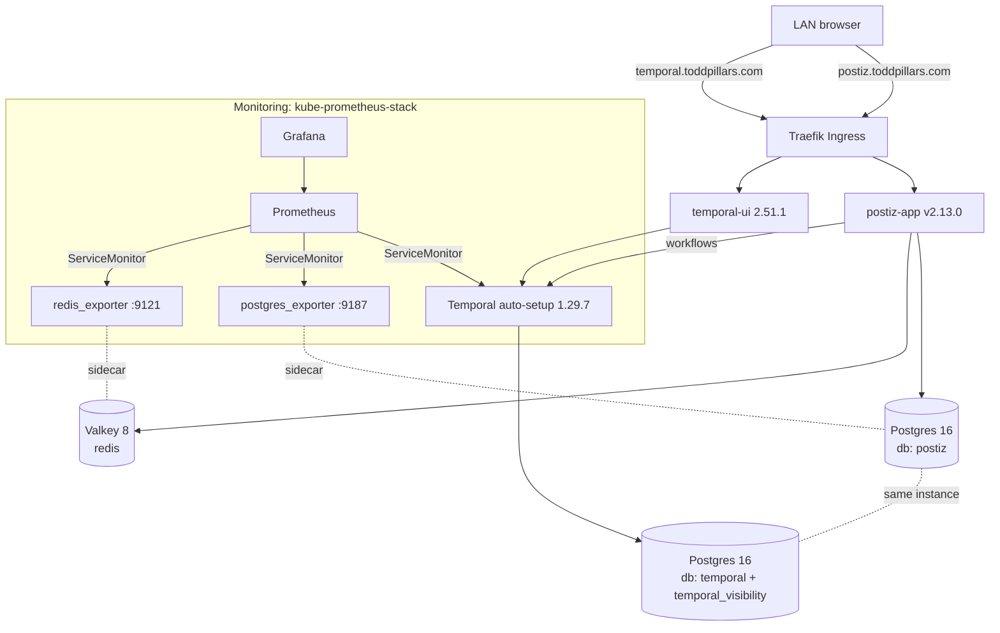

# Postiz Deployment & Operations

Deploying **Postiz** (self-hosted social-media scheduler) onto the K3s GitOps
homelab, worked around a broken upstream Helm chart, self-hosted its datastores,
stood up Temporal, added an operational console, and wired the whole stack into
Prometheus/Grafana. All declarative, all via FluxCD.

**Result:** Postiz v2 running LAN-only at `http://postiz.toddpillars.com`, fully
GitOps-managed and observable.

---

## TL;DR

| Item | Value |
|---|---|
| App | Postiz v2 (`ghcr.io/gitroomhq/postiz-app:v2.13.0`) |
| Namespace | `postiz` |
| URL (LAN-only) | `http://postiz.toddpillars.com` |
| Temporal console | `http://temporal.toddpillars.com` |
| Chart | Vendored PR #19 chart (`postiz-app` 1.1.0), sourced from the `flux-system` GitRepository |
| Datastores | Self-hosted Postgres + Valkey (Bitnami subcharts disabled) |
| Workflow engine | Temporal (`auto-setup:1.29.7`) — required by Postiz v2 |
| Secrets | SOPS/AGE (`*.enc.yaml`), injected via chart `extraSecrets` |
| Monitoring | Temporal + Postgres/Valkey exporters → ServiceMonitors + Grafana dashboards |
| PRs | #146 (install), #147 (Temporal UI), #148 (monitoring) |

---

## The problem this solved

Postiz should install from its official chart, but:

1. **The published chart is broken** ([issue #17](https://github.com/gitroomhq/postiz-helmchart/issues/17)).
   The only published artifact is OCI `oci://ghcr.io/gitroomhq/postiz-helmchart/charts/postiz-app`
   **v1.0.5** (no HTTP repo → `helm repo add` doesn't work). Its bundled Bitnami
   Postgres/Redis subcharts reference Docker Hub image tags Bitnami has retired →
   `ImagePullBackOff`.
2. **The fix ([PR #19](https://github.com/gitroomhq/postiz-helmchart/pull/19)) is unmerged**
   and does more than fix images — it upgrades to **Postiz v2**, swaps Redis for
   Valkey, and adds a hard dependency on an **external Temporal server**.

These overlapped with two blockers from a prior failed attempt: **Docker Hub rate
limits** on the K3s node, and **GitGuardian** flagging SOPS-encrypted secrets.

---

## Key decisions (and why)

- **Target Postiz v2 via PR #19** → accepted the Temporal requirement.
- **Vendor the fixed chart in-tree** (`infrastructure/controllers/base/postiz/chart/`)
  and source it from the existing `flux-system` GitRepository. Fully pinned, no
  reliance on a mutable fork branch staying alive. *(This is the repo's first
  git-sourced Helm chart — everything else uses `HelmRepository`.)*
- **Self-host Postgres + Valkey** (disabled the chart's Bitnami subcharts). This
  sidesteps issue #17 entirely and defuses the Docker Hub blocker.
- **Registry choices to avoid Docker Hub rate limits:**
  - Postiz → ghcr
  - Valkey → ghcr (`ghcr.io/valkey-io/valkey`)
  - Postgres → **AWS ECR public mirror** (`public.ecr.aws/docker/library/postgres`)
  - Exporters → quay
  - **Only** Temporal pulls from Docker Hub (one pinned image) — well under the anonymous limit, so no auth needed.
- **LAN-only exposure** — a Traefik `Ingress` per host, deliberately kept out of
  the cloudflared tunnel (same pattern as `open-webui`/`mealie`).
- **Secrets stay SOPS-encrypted** and are injected via the chart's `extraSecrets`
  hook, so nothing sensitive lands in plaintext Helm `values`. Added
  `.gitguardian.yaml` ignoring `**/*.enc.yaml`.

---

## Architecture



One Postgres instance holds three databases: `postiz` (app), plus `temporal`
and `temporal_visibility` (created by an init ConfigMap; Temporal's auto-setup
builds their schemas on first boot and registers the `default` namespace).

---

## What was deployed

### Application stack (`infrastructure/controllers/base/postiz/`)
| Component | Image | Notes |
|---|---|---|
| Postiz app | `ghcr.io/gitroomhq/postiz-app:v2.13.0` | HelmRelease, chart vendored in `chart/` |
| Postgres | `public.ecr.aws/docker/library/postgres:16-alpine` | `postgres.yaml` + init SQL ConfigMap |
| Valkey (Redis) | `ghcr.io/valkey-io/valkey:8-alpine` | `valkey.yaml` |
| Temporal | `docker.io/temporalio/auto-setup:1.29.7` | `temporal.yaml` |
| Temporal UI | `docker.io/temporalio/ui:2.51.1` | `temporal-ui.yaml` |

### Persistent volumes (all `local-path`)
- `postiz-postgres-data` — 5Gi
- `postiz-redis-data` — 1Gi
- `postiz-uploads` — 10Gi (mounted at `/uploads` via chart `extraVolumes`)

### Ingress (LAN-only, `staging/postiz/ingress.yaml`)
- `postiz.toddpillars.com` → `postiz-app:80`
- `temporal.toddpillars.com` → `postiz-temporal-ui:80`
- Both resolve to the Traefik ingress at **`192.168.0.72`** via local DNS; neither is in the cloudflared tunnel.

### Secrets (SOPS/AGE, `*.enc.yaml`)
- `postgres-secret.enc.yaml` → `POSTGRES_PASSWORD` (used by Postgres, Temporal, and the `DATABASE_URL`)
- `postiz-secrets-ext.enc.yaml` → `DATABASE_URL`, `REDIS_URL`, `JWT_SECRET` (+ social API keys as added)
- Injected into the app via chart `extraSecrets: [{ name: postiz-secrets-ext }]`

### Monitoring (`monitoring/controllers/base/kube-prometheus-stack/`)
- Temporal metrics enabled via `PROMETHEUS_ENDPOINT=0.0.0.0:9090`
- `postgres_exporter` sidecar (`quay.io/prometheuscommunity/postgres-exporter:v0.20.0`, `:9187`)
- `redis_exporter` sidecar (`quay.io/oliver006/redis_exporter:v1.86.0`, `:9121`)
- `postiz-servicemonitors.yaml` — 3 ServiceMonitors (in `monitoring` ns, label `release: kube-prometheus-stack`, `namespaceSelector → postiz`)
- `postiz-dashboards.configmap.yaml` — labeled `grafana_dashboard: "1"`, provisioning:
  - **Temporal Server Metrics** (official temporalio/dashboards)
  - **PostgreSQL** (grafana.com ID 9628)
  - **Redis** (grafana.com ID 763)

> The Postiz **app itself exposes no Prometheus metrics**, so app-level coverage
> is its datastores + Temporal. Pod CPU/mem/restarts come from the stack's
> built-in kube-state-metrics/cAdvisor (filter Grafana by `namespace=postiz`).

---

## Operational runbook

```bash
# Health at a glance
flux get helmreleases -n postiz
kubectl get pods -n postiz          # app + postgres(2/2) + redis(2/2) + temporal + temporal-ui

# Force a reconcile after a git change
flux reconcile kustomization infrastructure --with-source
flux reconcile kustomization monitoring-controllers

# Logs
kubectl logs -n postiz deploy/postiz-app
kubectl logs -n postiz deploy/postiz-temporal

# Edit a secret (re-encrypts on save)
sops infrastructure/controllers/base/postiz/postiz-secrets-ext.enc.yaml

# Backup (PVC data + Flux state)
./scripts/backup-cluster.sh
```

- **Prometheus targets:** Status → Targets → `postiz-temporal`, `postiz-postgres`, `postiz-redis` should be **UP**.
- **Grafana:** `grs.toddpillars.com` → the three new dashboards. On the Postgres/Redis
  dashboards, pick the instance/namespace in the dropdowns on first view.

---

## Gotchas / lessons

- **`appVersion` ≠ a valid image tag by default** — worth verifying every pinned
  image tag actually exists before applying (`v2.13.0` did; the chart default
  otherwise assumes it).
- **Bitnami free images are being retired** — bundled Bitnami subcharts are a
  liability; self-hosting datastores (or using non–Docker-Hub mirrors) is more
  durable.
- **Postiz v2 needs Temporal** — this is the single biggest hidden cost of PR #19
  vs. the old v1 chart. `auto-setup` (single container) is the simplest way to
  run it; it shares the app's Postgres via extra databases.
- **`MAIN_URL` not required** — the app boots fine with `FRONTEND_URL` /
  `NEXT_PUBLIC_BACKEND_URL` set.
- **GitGuardian scanning is dashboard-side**, not a PR check on this repo —
  `.gitguardian.yaml` only governs the ggshield CLI; false positives on SOPS
  ciphertext are marked in the GitGuardian dashboard if they occur.
- **PRs must actually merge to `main`** — Flux only reconciles `main`; nothing
  deploys from an open PR.

---

## Follow-ups / future work

- [ ] **Prometheus alert rules** — Temporal task-queue backlog, Postgres down, Redis memory pressure.
- [ ] Add **social platform API keys** to `postiz-secrets-ext.enc.yaml` as channels are connected (X, LinkedIn, Reddit, GitHub, etc.).
- [ ] Optional **TLS on the LAN** (add a `tls:` block + local/wildcard cert to the ingresses) if plain HTTP becomes a bother.
- [ ] Exercise a **scheduled post** end-to-end to confirm the Temporal workflow path under real load.

---

## Reference

- Postiz app: <https://github.com/gitroomhq/postiz-app>
- Helm chart (upstream): <https://github.com/gitroomhq/postiz-helmchart>
- Fix PR used: <https://github.com/gitroomhq/postiz-helmchart/pull/19> (fork `Wihrt`, branch `feat/add_temporal_helm_chart`)
- Temporal dashboards: <https://github.com/temporalio/dashboards>
- Homelab PRs: #146 (install), #147 (Temporal UI), #148 (monitoring)
